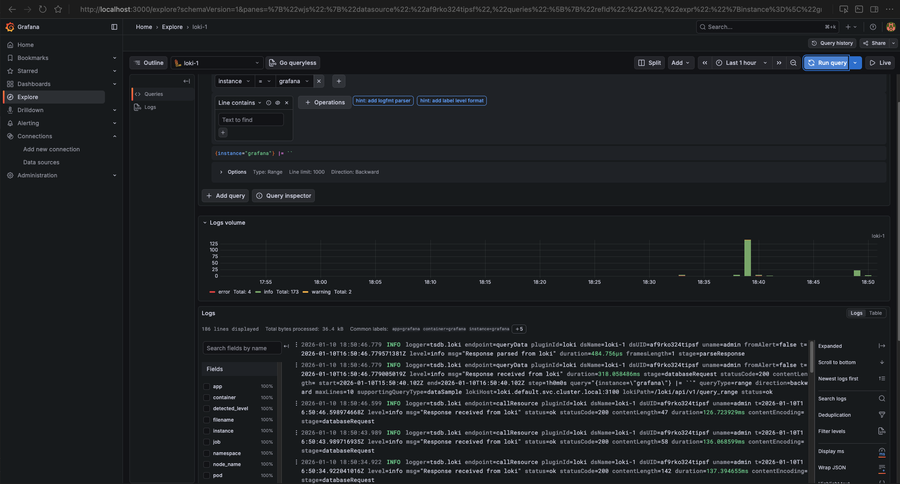

# Результаты вывода команд и указания файлов для задания

## Команда

```bash
kubectl get node -o wide --show-labels
```

## Вывод команды

```bash
NAME                        STATUS   ROLES    AGE     VERSION   INTERNAL-IP   EXTERNAL-IP       OS-IMAGE             KERNEL-VERSION       CONTAINER-RUNTIME     LABELS
cl1507siu7u4q98t2vd0-uvol   Ready    <none>   6m2s    v1.33.3   10.130.0.21   84.252.132.141    Ubuntu 22.04.5 LTS   5.15.0-161-generic   containerd://1.7.27   beta.kubernetes.io/arch=amd64,beta.kubernetes.io/instance-type=standard-v3,beta.kubernetes.io/os=linux,failure-domain.beta.kubernetes.io/zone=ru-central1-d,kubernetes.io/arch=amd64,kubernetes.io/hostname=cl1507siu7u4q98t2vd0-uvol,kubernetes.io/os=linux,node.kubernetes.io/instance-type=standard-v3,node.kubernetes.io/kube-proxy-ds-ready=true,node.kubernetes.io/masq-agent-ds-ready=true,node.kubernetes.io/node-problem-detector-ds-ready=true,topology.kubernetes.io/zone=ru-central1-d,yandex.cloud/node-group-id=catqr79opqk0439b7vg8,yandex.cloud/pci-topology=k8s,yandex.cloud/preemptible=false
cl1pg6u36f7ih565c49t-ojen   Ready    <none>   7m23s   v1.33.3   10.130.0.18   158.160.206.129   Ubuntu 22.04.5 LTS   5.15.0-161-generic   containerd://1.7.27   beta.kubernetes.io/arch=amd64,beta.kubernetes.io/instance-type=standard-v3,beta.kubernetes.io/os=linux,failure-domain.beta.kubernetes.io/zone=ru-central1-d,kubernetes.io/arch=amd64,kubernetes.io/hostname=cl1pg6u36f7ih565c49t-ojen,kubernetes.io/os=linux,node.kubernetes.io/instance-type=standard-v3,node.kubernetes.io/kube-proxy-ds-ready=true,node.kubernetes.io/masq-agent-ds-ready=true,node.kubernetes.io/node-problem-detector-ds-ready=true,topology.kubernetes.io/zone=ru-central1-d,yandex.cloud/node-group-id=cat0m5ktkbib3sja2apq,yandex.cloud/pci-topology=k8s,yandex.cloud/preemptible=false
```

Ниже представлено более удобное отображение результата вывода команды

## Узлы кластера

### Узел 1: cl1507siu7u4q98t2vd0-uvol

| Параметр | Значение |
| --- | --- |
| **Статус** | Ready |
| **Роль** | отсутствует |
| **Возраст** | 6m2s |
| **Версия Kubernetes** | v1.33.3 |
| **Внутренний IP** | 10.130.0.21 |
| **Внешний IP** | 84.252.132.141 |
| **ОС** | Ubuntu 22.04.5 LTS |
| **Версия ядра** | 5.15.0-161-generic |
| **Container Runtime** | containerd://1.7.27 |

#### Метки узла 1 (Labels)

- `beta.kubernetes.io/arch=amd64`
- `beta.kubernetes.io/instance-type=standard-v3`
- `beta.kubernetes.io/os=linux`
- `failure-domain.beta.kubernetes.io/zone=ru-central1-d`
- `kubernetes.io/arch=amd64`
- `kubernetes.io/hostname=cl1507siu7u4q98t2vd0-uvol`
- `kubernetes.io/os=linux`
- `node.kubernetes.io/instance-type=standard-v3`
- `node.kubernetes.io/kube-proxy-ds-ready=true`
- `node.kubernetes.io/masq-agent-ds-ready=true`
- `node.kubernetes.io/node-problem-detector-ds-ready=true`
- `topology.kubernetes.io/zone=ru-central1-d`
- `yandex.cloud/node-group-id=catqr79opqk0439b7vg8`
- `yandex.cloud/pci-topology=k8s`
- `yandex.cloud/preemptible=false`

---

### Узел 2: cl1pg6u36f7ih565c49t-ojen

| Параметр | Значение |
| --- | --- |
| **Статус** | Ready |
| **Роль** | отсутствует |
| **Возраст** | 7m23s |
| **Версия Kubernetes** | v1.33.3 |
| **Внутренний IP** | 10.130.0.18 |
| **Внешний IP** | 158.160.206.129 |
| **ОС** | Ubuntu 22.04.5 LTS |
| **Версия ядра** | 5.15.0-161-generic |
| **Container Runtime** | containerd://1.7.27 |

#### Метки узла 2 (Labels)

- `beta.kubernetes.io/arch=amd64`
- `beta.kubernetes.io/instance-type=standard-v3`
- `beta.kubernetes.io/os=linux`
- `failure-domain.beta.kubernetes.io/zone=ru-central1-d`
- `kubernetes.io/arch=amd64`
- `kubernetes.io/hostname=cl1pg6u36f7ih565c49t-ojen`
- `kubernetes.io/os=linux`
- `node.kubernetes.io/instance-type=standard-v3`
- `node.kubernetes.io/kube-proxy-ds-ready=true`
- `node.kubernetes.io/masq-agent-ds-ready=true`
- `node.kubernetes.io/node-problem-detector-ds-ready=true`
- `topology.kubernetes.io/zone=ru-central1-d`
- `yandex.cloud/node-group-id=cat0m5ktkbib3sja2apq`
- `yandex.cloud/pci-topology=k8s`
- `yandex.cloud/preemptible=false`

## Команда для вывода taints

```bash
kubectl get nodes -o custom-columns=NAME:metadata.name,TAINTS:.spec.taints
```

## Результат вывода команды

```bash
NAME                        TAINTS
cl1507siu7u4q98t2vd0-uvol   [map[effect:NoSchedule key:node-role value:infra]]
cl1pg6u36f7ih565c49t-ojen   <none>
```

Ниже представлено более удобное представление результата вывода команды

### Узел 1 cl1507siu7u4q98t2vd0-uvol

| Параметр | Значение |
| --- | --- |
| **Имя** | cl1507siu7u4q98t2vd0-uvol |
| **Тaints** | [map[effect:NoSchedule key:node-role value:infra]] |

### Узел 2 cl1pg6u36f7ih565c49t-ojen

| Параметр | Значение |
| --- | --- |
| **Имя** | cl1pg6u36f7ih565c49t-ojen |
| **Тaints** | отсутствуют |

## Сводка по установке

Все три компонента (Loki, Promtail, Grafana) устанавливаются из одного Helm-репозитория:

**Репозиторий:** `grafana`  
**URL:** <https://grafana.github.io/helm-charts>

**Команды установки:**

```bash
# 1. Добавление репозитория
helm repo add grafana https://grafana.github.io/helm-charts
helm repo update

# 2. Создание секрета для S3
kubectl apply -f secret.yaml

# 3. Установка Loki
helm install loki grafana/loki -n default -f loki-values.yaml

# 4. Установка Promtail
helm install promtail grafana/promtail -n default -f promtail-values.yaml

# 5. Установка Grafana
helm install grafana grafana/grafana -n default -f grafana-values.yaml
```

---

## Loki

### Файлы для задания

- [sa-key.json](./sa-key.json) - ключ для доступа к хранилищу логов для Loki
- [loki-values.yaml](./loki-values.yaml) - конфигурация Helm chart для Loki
- [promtail-values.yaml](./promtail-values.yaml) - конфигурация Helm chart для Promtail
- [grafana-values.yaml](./grafana-values.yaml) - конфигурация Helm chart для Grafana
- [secret.yaml](./secret.yaml) - Kubernetes Secret с учётными данными для S3

### Получение учётных данных для S3

Учётные данные для подключения к Yandex Object Storage берутся из файла `sa-key.json`, сгенерированы командой

```bash
yc iam access-key create \
   --service-account-name=svcloki \
   --format=json > sa-key.json
```

- **AWS_ACCESS_KEY_ID** = значение поля `access_key.id` (в примере: `aje4rjpd1csvrpj4nn0v`)
- **AWS_SECRET_ACCESS_KEY** = значение поля `secret` (в примере: `YCNrU40TzyKgZ-VtBqYMchOIpiCrTL50y8bERsLr`)

Эти значения уже указаны в файле [secret.yaml](./secret.yaml).

### Установка Loki

Далее была произведена установка Loki не через Marketplace, так как данный вариант не позволяет гибко настраивать параметры, а через Helm и файл [loki-values.yaml](./loki-values.yaml)

#### 1. Добавление Helm репозитория

```bash
helm repo add grafana https://grafana.github.io/helm-charts
helm repo update
```

#### 2. Добавление метки на infra-ноду

**ВАЖНО:** По заданию требуется размещение Loki ИСКЛЮЧИТЕЛЬНО на infra-нодах. Для этого необходимо добавить метку `node-role=infra` на infra-ноду:

```bash
# Найти infra-ноду с taint
kubectl get nodes -o custom-columns=NAME:metadata.name,TAINTS:.spec.taints

# Добавить метку на infra-ноду (замените на имя вашей infra-ноды)
kubectl label node <имя-infra-ноды> node-role=infra

# Проверить, что метка добавлена (должна быть видна метка node-role=infra)
kubectl get node <имя-infra-ноды> --show-labels | grep node-role

# Если метка уже существует, команда вернёт ошибку - это нормально
```

**Примечание:** Если метка уже существует, команда вернет ошибку. Это нормально - метка уже есть.

#### 3. Создание секрета с учётными данными

Перед установкой Loki необходимо создать Kubernetes Secret с учётными данными для доступа к S3:

```bash
kubectl apply -f secret.yaml
```

Или создать секрет вручную из значений `sa-key.json`:

```bash
kubectl create secret generic loki-s3-credentials \
  --from-literal=AWS_ACCESS_KEY_ID='<значение из access_key.id>' \
  --from-literal=AWS_SECRET_ACCESS_KEY='<значение из secret>' \
  -n default
```

#### 4. Установка Loki

```bash
helm install loki grafana/loki -n default -f loki-values.yaml
```

**Примечание:** Если Loki уже установлен и нужно переместить его на infra-ноды:

```bash
# Сначала убедитесь, что метка добавлена на infra-ноду
kubectl get node <имя-infra-ноды> --show-labels | grep node-role

# Если метки нет, добавьте её
kubectl label node <имя-infra-ноды> node-role=infra

# Полностью переустановите Loki для применения singleBinary режима
helm uninstall loki -n default
helm install loki grafana/loki -n default -f loki-values.yaml
```

После установки проверьте, что поды Loki размещены на infra-нодах и работают в singleBinary режиме:

```bash
# Проверить размещение подов
kubectl get pods -n default -l app.kubernetes.io/name=loki -o wide

# Должен быть только один под loki (singleBinary режим)
# Если видны поды loki-backend, loki-gateway и т.д. - значит, singleBinary не применился
```

#### 5. Проверка установки

```bash
helm list -n default
kubectl get pods -n default -l app.kubernetes.io/name=loki
```

**Особенности конфигурации:**

- Размещение ИСКЛЮЧИТЕЛЬНО на infra-нодах через `nodeSelector` и `toleration`
- Хранение логов в S3 бакете Yandex Object Storage
- Аутентификация отключена (`auth_enabled: false`)
- Одиночный режим (`singleBinary`) с `replication_factor: 1`

---

## Promtail

### Установка Promtail

Promtail устанавливается как DaemonSet для сбора логов со всех нод кластера, включая infra-ноды.

#### 1. Установка Promtail

```bash
helm install promtail grafana/promtail -n default -f promtail-values.yaml
```

#### 2. Проверка установки

```bash
# Проверка подов Promtail (должен быть на каждой ноде)
kubectl get pods -n default -l app.kubernetes.io/name=promtail

# Проверка DaemonSet
kubectl get daemonset -n default promtail
```

**Репозиторий:** `grafana` (<https://grafana.github.io/helm-charts>)  
**Chart:** `promtail`  
**Файл конфигурации:** [promtail-values.yaml](./promtail-values.yaml)

**Особенности конфигурации:**

- Установлен toleration для работы на infra-нодах с taint `node-role=infra`
- Настроен сбор логов из `/var/log/pods` (Kubernetes service discovery автоматически определяет путь к логам контейнеров)
- Отправка логов в Loki по адресу `http://loki.default.svc.cluster.local:3100`

---

## Grafana

### Установка Grafana

Grafana устанавливается на infra-ноды с использованием nodeSelector и toleration (аналогично Loki).

**ВАЖНО:** Перед установкой Grafana необходимо добавить метку `node-role=infra` на infra-ноду (если еще не добавлена для Loki):

```bash
# Найти infra-ноду с taint
kubectl get nodes -o custom-columns=NAME:metadata.name,TAINTS:.spec.taints

# Добавить метку на infra-ноду (замените на имя вашей infra-ноды)
kubectl label node <имя-infra-ноды> node-role=infra
```

#### 1. Установка Grafana

```bash
helm install grafana grafana/grafana -n default -f grafana-values.yaml
```

**Примечание:** Если Grafana уже установлена и нужно обновить конфигурацию data source:

```bash
helm upgrade grafana grafana/grafana -n default -f grafana-values.yaml
```

После обновления может потребоваться перезапуск пода Grafana для применения изменений:

```bash
kubectl rollout restart deployment grafana -n default
```

#### 2. Получение пароля администратора

```bash
kubectl get secret --namespace default grafana -o jsonpath="{.data.admin-password}" | base64 --decode ; echo
```

По умолчанию в конфигурации: `admin/admin`

#### 3. Проброс порта для доступа к Grafana

```bash
kubectl port-forward -n default svc/grafana 3000:80
```

Grafana будет доступна в браузере по адресу: <http://localhost:3000>

#### 4. Проверка установки Grafana

```bash
# Проверка пода Grafana
kubectl get pods -n default -l app.kubernetes.io/name=grafana

# Проверка сервиса
kubectl get svc -n default grafana
```

**Репозиторий:** `grafana` (<https://grafana.github.io/helm-charts>)  
**Chart:** `grafana`  
**Файл конфигурации:** [grafana-values.yaml](./grafana-values.yaml)

**Особенности конфигурации:**

- Установлен на infra-ноды через `nodeAffinity` с меткой `node-role=infra`
- Добавлен toleration для taint `node-role=infra`
- Автоматически настроен data source для Loki
- По умолчанию логин/пароль: `admin/admin`

### Настройка Data Source в Grafana

Data source для Loki уже настроен автоматически через конфигурацию в `grafana-values.yaml`. Если требуется настроить вручную:

**Важно:** URL зависит от режима установки Loki:

- **SingleBinary режим:** `http://loki.default.svc.cluster.local:3100`
- **Распределённый режим (через gateway):** `http://loki-gateway.default.svc.cluster.local:80`

#### Диагностика проблем с подключением

Если возникает ошибка "An error occured within the plugin" в Explore:

1. **Проверить доступные сервисы Loki:**

   ```bash
   kubectl get svc -n default | grep loki
   ```

   Для singleBinary режима должен быть сервис `loki` на порту 3100.

2. **Проверить доступность Loki из пода Grafana:**

   ```bash
   # Войти в под Grafana
   kubectl exec -it -n default deployment/grafana -- sh
   
   # Проверить доступность Loki
   wget -O- http://loki.default.svc.cluster.local:3100/ready
   # Должен вернуть: ready
   
   # Или проверить через curl
   curl http://loki.default.svc.cluster.local:3100/ready
   ```

3. **Проверить логи Grafana на наличие ошибок:**

   ```bash
   kubectl logs -n default deployment/grafana --tail=50 | grep -i loki
   ```

4. **Проверить логи Loki:**

   ```bash
   kubectl logs -n default loki-0 --tail=50
   ```

5. **Проверить статус пода Loki:**

   ```bash
   kubectl get pod loki-0 -n default
   kubectl describe pod loki-0 -n default | grep -A 10 "Events:"
   ```

6. **Обновить Grafana с правильной конфигурацией:**

   ```bash
   helm upgrade grafana grafana/grafana -n default -f grafana-values.yaml
   kubectl rollout restart deployment grafana -n default
   ```

#### Ручная настройка Data Source

1. Войдите в Grafana (<http://localhost:3000>)
2. Перейдите в **Connections** → **Data sources**
3. Найдите существующий data source **Loki** или нажмите **Add new data source**
4. Выберите **Loki**
5. В поле **URL** укажите: `http://loki.default.svc.cluster.local:3100` (для singleBinary)
6. Нажмите **Save & Test**
7. Если тест не проходит, проверьте доступность Loki (см. диагностику выше)

Скриншот Grafana:


